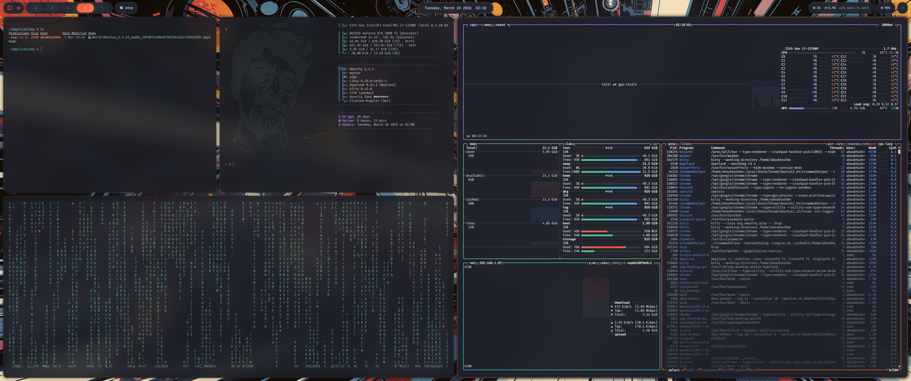

# Aurelia Dark

<p align="center">
  
</p>

<p align="center">
  <strong>A modern, elegant, and premium theme for Omarchy / Hyprland.</strong>
</p>

---

## Overview

**Aurelia Dark** is a refined theme crafted for the **Omarchy Hyprland** ecosystem. It delivers a polished desktop experience with cohesive styling across key system components, combining deep dark surfaces with vivid accents for a rich, modern aesthetic.

The name **Aurelia** is often associated with meanings such as *golden* and *moon jelly*, which reflects the theme’s balance of depth, softness, and striking contrast.

On **OLED displays**, Aurelia Dark looks especially sharp.

---

## Installation

Aurelia Dark is designed for **Omarchy Hyprland** and comes with an automated installation script that configures all components.

### Quick Install — One Command

```bash
bash <(curl -s https://raw.githubusercontent.com/TshiSelle/Aurelia-Dark/main/install.sh)
```

This command will:

- Clone the theme repository (if not already installed)
- Deploy theme files to Omarchy
- Configure system hooks
- Install all wallpapers
- Apply the theme automatically
- Verify the installation

### Manual Installation Steps

**Step 1:** Clone the repository

```bash
git clone https://github.com/TshiSelle/Aurelia-Dark.git ~/.config/omarchy/themes/aurelia-dark
```

**Step 2:** Run the installation script

```bash
~/.config/omarchy/themes/aurelia-dark/install.sh
```

**Step 3:** The theme will apply automatically. Enjoy!

### Alternative — Walker Menu

If you prefer using Omarchy’s built-in theme installer:

1. Open **Walker**: `SUPER + ALT + SPACE`
2. Navigate to: **Install → Style → Theme**
3. Paste: `https://github.com/TshiSelle/Aurelia-Dark.git`
4. Press **Enter**

Note: Using the custom `install.sh` script ensures all components (wallpapers, hooks, styling) are properly configured.

---

## Features

Aurelia Dark redesigns multiple parts of the Omarchy environment to create a consistent and premium visual experience.

### Desktop Components

- **Waybar** — full premium redesign
- **Walker** — complete launcher redesign
- **Hyprlock** — modern lockscreen styling
- **Notifications** — display duration increased from **5s** to **8s**

### Terminal Support

Supported terminals:

- **Alacritty**
- **Kitty**
- **Ghostty**

Terminal color palettes are tuned to match the Aurelia Dark visual identity.

### Browser Support

Supported browsers:

- **Chromium-based browsers**

### TUI Application Styling

Aurelia Dark also adjusts terminal UI colors for tools such as:

- **Neovim / LazyVim**
- **btop++**
- **nvtop**
- Other CLI utilities

### Wallpapers

Included with the theme:

- **43 high-definition wallpapers** (planned)
- Support for **all aspect ratios**
- Artwork selected to complement the Aurelia palette
- Easy to add more wallpapers — see [Adding Wallpapers](#adding-wallpapers) below

### Animations

System animations are tuned for a **fast, fluid, and responsive** experience, with a focus on smoothness without sacrificing performance.

---

## Adding Wallpapers

Want to add more wallpapers to Aurelia Dark? It's simple:

1. **Add wallpaper files** to the `backgrounds/` folder:

   ```bash
   cp your-wallpaper.jpg ~/.config/omarchy/themes/aurelia-dark/backgrounds/
   ```

   **Naming convention:** `aur-*.jpg` (e.g., `aur-1.jpg`, `aur-2.jpg`, etc.)

2. **Re-apply the theme** to load the new wallpapers:

   - Open Walker: `SUPER + ALT + SPACE`
   - Go to: **Install → Style → Theme**
   - Select **Aurelia Dark** and apply

3. **View your wallpapers**:
   - Open Walker again
   - Go to: **Style → Background**
   - New wallpapers appear in the list!

### Tips

- Wallpapers should be JPG, PNG, or WebP format
- Follow the naming convention: `aur-{number}.jpg`
- Wallpapers appear in the menu in alphabetical order
- When you re-apply the theme, all backgrounds in the folder are automatically available

---

## Requirements

- **Omarchy** 3.4.0 or later
- **Hyprland** 0.45.0 or later
- **Wayland** display server
- **Git** (for installation and updates)

### Optional Dependencies

For full feature support, these are recommended but not required:

- **Alacritty** or **Kitty** (for terminal theming)
- **Waybar** (for taskbar styling)
- **Walker** (for launcher styling)
- **Hyprlock** (for lockscreen styling)
- **Mako** (for notification styling)

---

## Troubleshooting

### Wallpapers not showing in Style > Background menu

The wallpapers should appear automatically after installation. If they don't:

1. Check that backgrounds are in the correct location:
   ```bash
   ls ~/.config/omarchy/backgrounds/aurelia-dark/
   ```

2. If empty, manually copy them:
   ```bash
   cp ~/.config/omarchy/themes/aurelia-dark/backgrounds/*.jpg ~/.config/omarchy/backgrounds/aurelia-dark/
   ```

3. Refresh Walker or restart it with `pkill -f walker`

### Theme files not being applied

If components like Waybar or Walker aren't showing the theme colors:

1. Verify the theme is active:
   ```bash
   cat ~/.config/omarchy/current/theme.name
   ```
   Should output: `aurelia-dark`

2. Trigger the theme-set hook:
   ```bash
   ~/.config/omarchy/hooks/theme-set aurelia-dark
   ```

3. Restart the affected application

### GTK applications still show wrong colors

The theme includes GTK CSS overrides. To apply them manually:

```bash
~/.config/omarchy/hooks/theme-set aurelia-dark
```

Then restart GTK applications (GNOME Settings, Files, etc.)

---

## Aether Integration

Omarchy themes can be extended using **Aether**, which comes pre-installed on Omarchy systems.

Aether enables deeper customization, including:

- Neovim theming
- Shader configuration
- Font selection
- Template customization
- Dynamic color generation
- Experimental GTK application colors

### Project Page

```text
https://github.com/bjarneo/aether
```

### Install from AUR

If you are not using Omarchy, Aether can be installed from the AUR with:

```bash
yay -S aether
```

---

## What the Installation Script Does

The `install.sh` script automates the complete theme installation:

1. **Theme Deployment** — Copies all theme files to Omarchy
2. **System Hooks** — Sets up the `theme-set` hook for GTK CSS integration
3. **Wallpaper Installation** — Configures all included backgrounds for Walker's Style menu
4. **Dependency Verification** — Ensures Omarchy is properly installed
5. **Theme Application** — Automatically activates the theme
6. **Verification** — Confirms successful installation

## What Aurelia Dark Changes

Once installed, Aurelia Dark applies styling across the entire system:

### Desktop Environment
- **Waybar** — Premium taskbar with orange accents and custom layout
- **Walker** — iOS-inspired launcher with rounded corners and translucency
- **Hyprlock** — Modern lockscreen with blurred background support
- **Notifications** (Mako) — Orange-accented notification bubbles with 8-second duration
- **OSD** (SwayOSD) — Volume and brightness indicators with theme colors

### Terminals & Text Editors
- **Alacritty** — Full color scheme + animated block cursor
- **Kitty** — Color scheme with smooth cursor animation
- **Ghostty** — Color scheme with cursor blinking
- **Neovim** — Aether theme with orange accents
- **VS Code** — One Dark Pro theme with Aurelia adjustments

### System Components
- **GTK3/4** — Comprehensive CSS overrides for all GTK applications
- **Icons** — Yaru-red-dark icon theme
- **Animations** — Fine-tuned spring animations for fluid interactions
- **Cursor** — Orange accent with smooth animations

### Terminal Applications
- **btop++** — System monitor with theme colors
- **FZF** — Fuzzy finder with orange highlights
- **CAVA** — Audio visualizer with gradient colors
- **Fish Shell** — Color variables for consistent theming

The result is a **cohesive, premium Omarchy desktop aesthetic** with consistent styling across all applications and system components.

---

## Theme Structure

```
aurelia-dark/
├── install.sh                  # Automated installation script
├── colors.toml                 # Core color palette (template source)
├── README.md                   # This file
├── preview.png                 # Theme preview image
│
├── hyprland.conf               # Hyprland window manager config
├── hyprlock.conf               # Lockscreen styling
│
├── alacritty.toml              # Alacritty terminal colors
├── ghostty.conf                # Ghostty terminal colors
├── kitty.conf                  # Kitty terminal colors
├── walker.css                  # Walker launcher styling
├── waybar.css                  # Waybar taskbar styling
├── waybar-theme/               # Waybar configuration
│   ├── config.jsonc            # Waybar layout & widgets
│   └── style.css               # Waybar styling
│
├── gtk.css                     # GTK3/4 application styling
├── swayosd.css                 # OSD (volume/brightness) styling
├── mako.ini                    # Notification daemon config
│
├── neovim.lua                  # Neovim colorscheme
├── vscode.json                 # VS Code theme settings
├── btop.theme                  # System monitor colors
├── cava_theme                  # Audio visualizer colors
├── fzf.fish                    # FZF fuzzy finder colors
├── colors.fish                 # Fish shell color variables
├── icons.theme                 # GTK icon theme setting
│
└── backgrounds/                # Wallpaper collection
    ├── aur-1.jpg
    ├── aur-2.jpg
    └── ... (up to 43 images)
```

The `install.sh` script handles deploying these files to their correct system locations and setting up the necessary hooks.

---

## Why Choose Aurelia Dark

- Clean and modern dark design
- Consistent styling across the full environment
- OLED-friendly visual balance
- Enhanced wallpapers and polished animations
- Ready to install and apply in seconds


